# Features✨

## Bootstrap-Powered Navigation
The navigation of our site is powered by Bootstrap, a leading front-end framework. This integration allows for a sleek, modern navbar that is both functional and visually appealing. It includes responsive features, ensuring that our navigation is easy to use on any device.

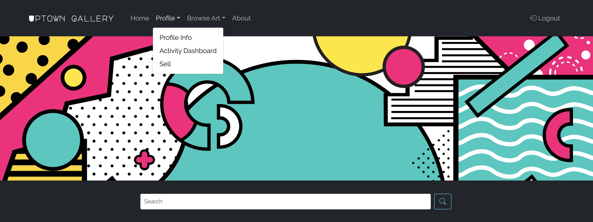

## Integrated Bootstrap Icons
We utilize Bootstrap Icons extensively across our website. These icons add a clean and professional touch to our user interface, enhancing the overall aesthetic and user experience. The icons are used in various parts of our site, including the navigation bar and social media links, providing a cohesive and stylish look.

## Diverse Art Categories
The website features a wide range of art categories, allowing users to browse through an extensive collection of paintings, sculptures, photography, and more. Each category is easily accessible through a user-friendly dropdown menu, making it simple for visitors to find exactly what they're looking for.

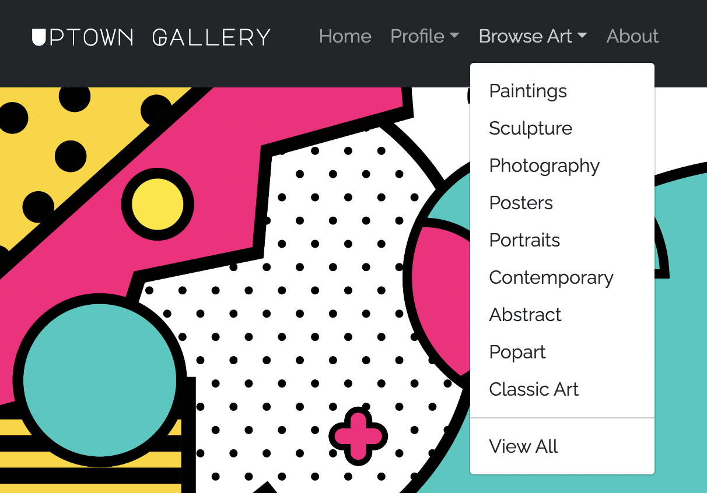

# User Engagement Features
For registered users, our site offers personalized features like a Profile section, Activity Dashboard, and the option to sell artwork. These features are designed to engage users more deeply with the Uptown Gallery community.

## Efficient Search Functionality
A prominent search bar, powered by a simple and effective form, allows visitors to quickly find artworks or information on our site. This feature enhances the user experience by making navigation and discovery straightforward and efficient.

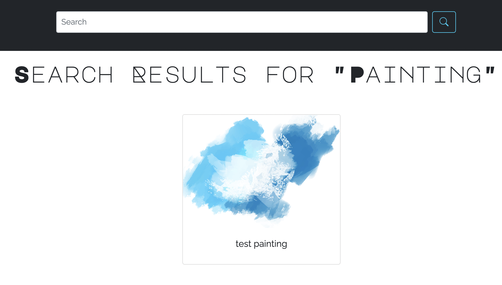

## Social Media Integration
Our footer includes links to our social media platforms, represented by Bootstrap Icons. This integration ensures visitors can stay connected with us on various social platforms, fostering a stronger community around our gallery.

# User Interaction and Management

## User Registration and Profile Management

- Easy Registration Process: Visitors can quickly become members of the Uptown Gallery community by signing up through a straightforward registration process.
  
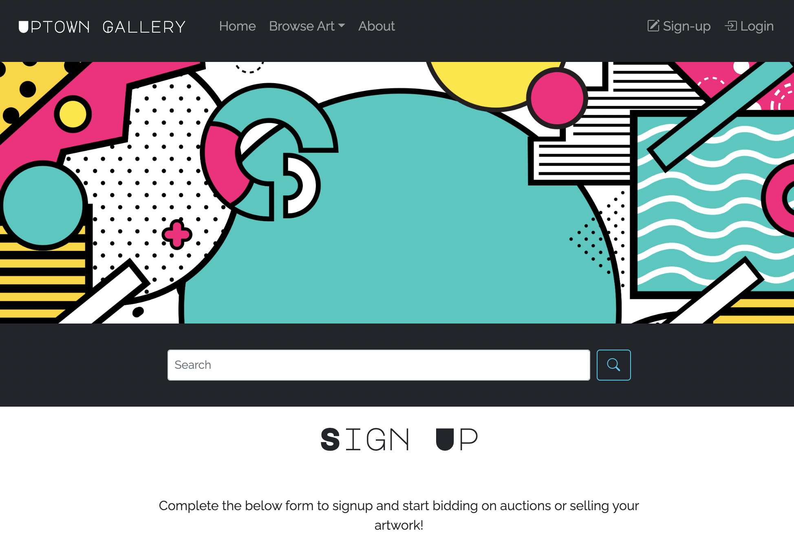

- Profile Customization: Once registered, users can view and update their profile information, including changing their name and address, ensuring a personalized experience.
  
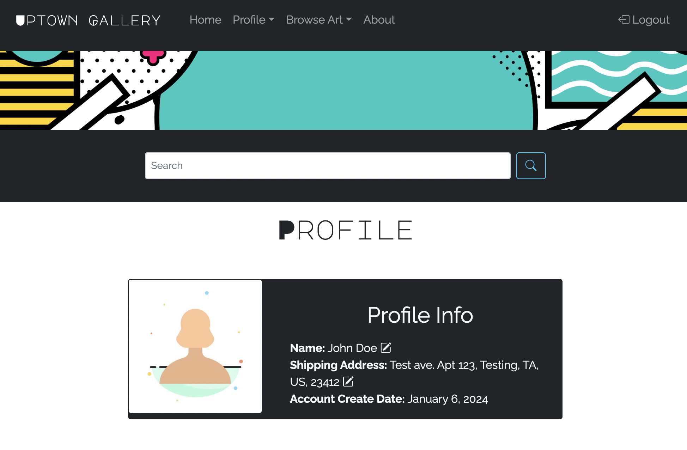

## Browsing and Bidding on Artwork

- Quick View Modal: Our site offers a 'Quick View' modal for each artwork, allowing users to glance at the essential details without leaving the page.

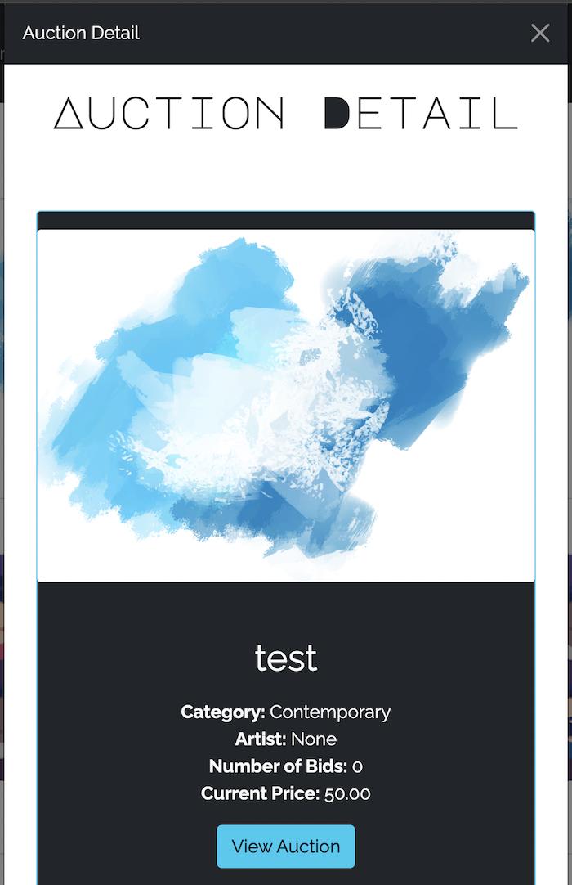

- Detailed Auction Pages: For users interested in placing bids, clicking on an artwork opens a detailed auction page. Here, users can find in-depth information about the artwork and participate in the bidding process.

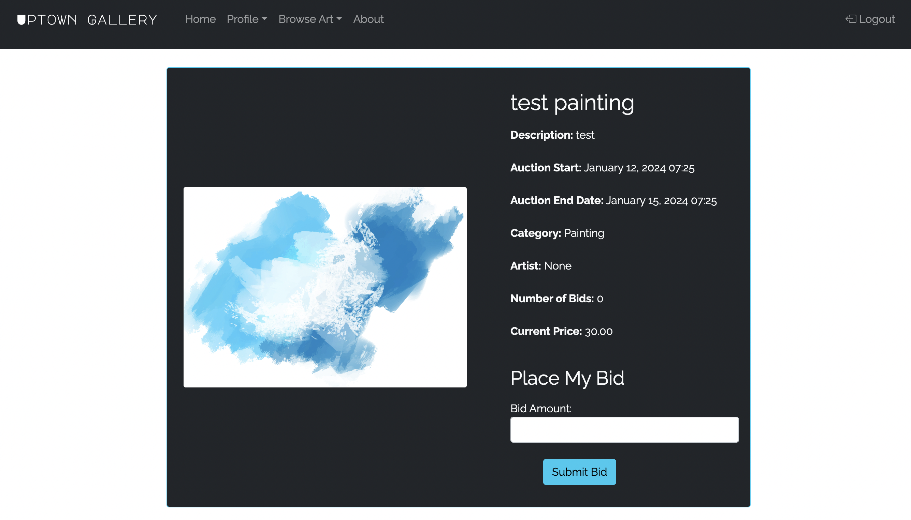
  
## Activity Dashboard

- Comprehensive Activity Tracking: Users have access to an Activity Dashboard, where they can monitor all their interactions on the site, including bids placed, artworks followed, and more. This feature provides a central place to track their engagement with the gallery.

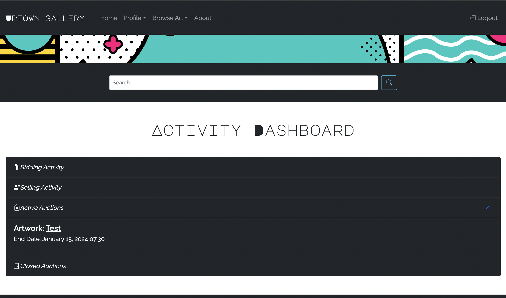
  
## Features for Sellers/Artists

- Artwork Listing Creation: Artists and sellers on our platform can easily list their artworks for sale. This feature is designed to be intuitive, guiding sellers through the process of creating a listing.

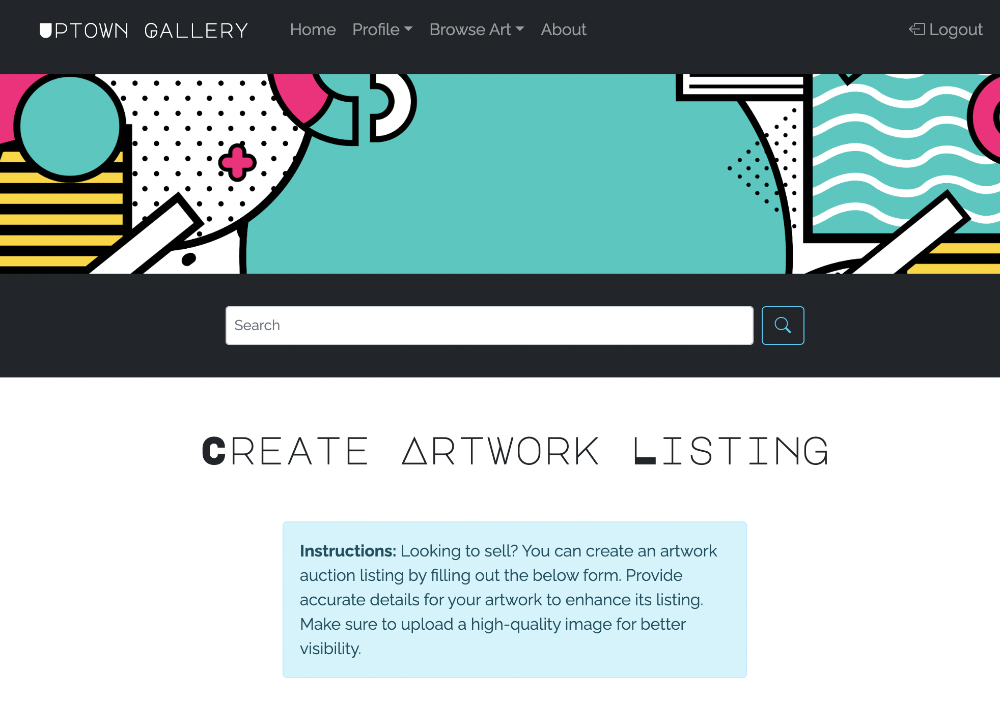

- Editing and Deletion of Listings: Sellers have the flexibility to edit or delete their listings while they are still pending approval, giving them control over their offerings.

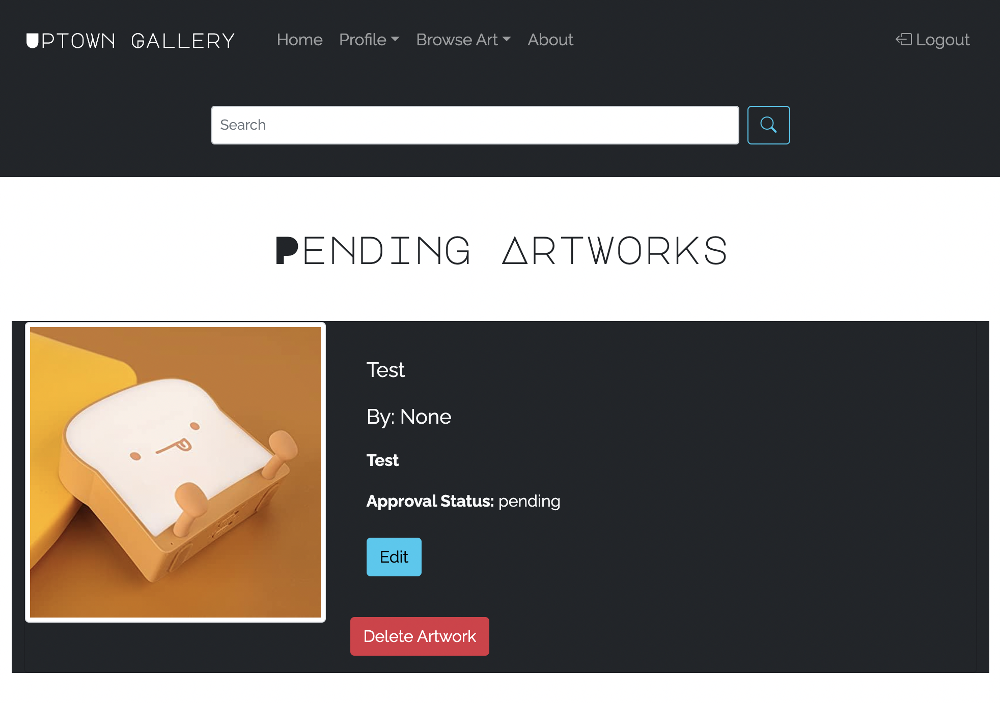
  
## Admin Panel for Artwork Management

[Link to Admin Login Page Here](https://uptowngallery-c4ad28352563.herokuapp.com/admin/)

- Admin Capabilities: Admins have the ability to view, edit, delete, approve, or reject artwork listings. This control ensures that only suitable and high-quality artworks are available on the site, maintaining the integrity and reputation of the Uptown Gallery.

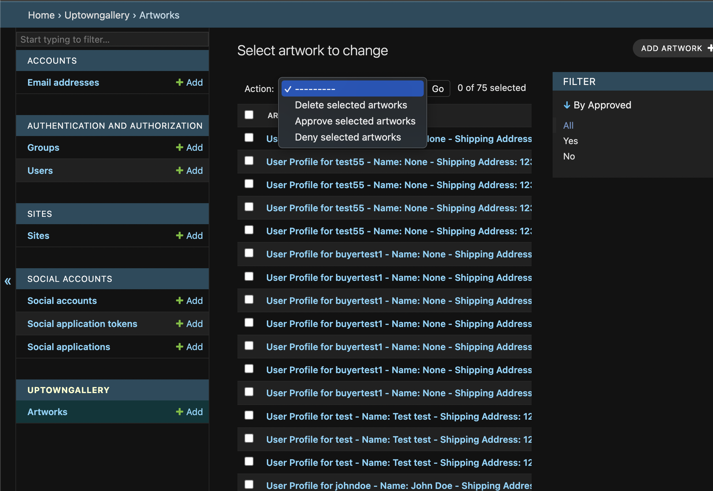

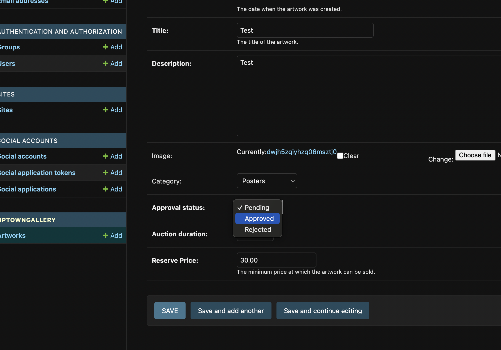

