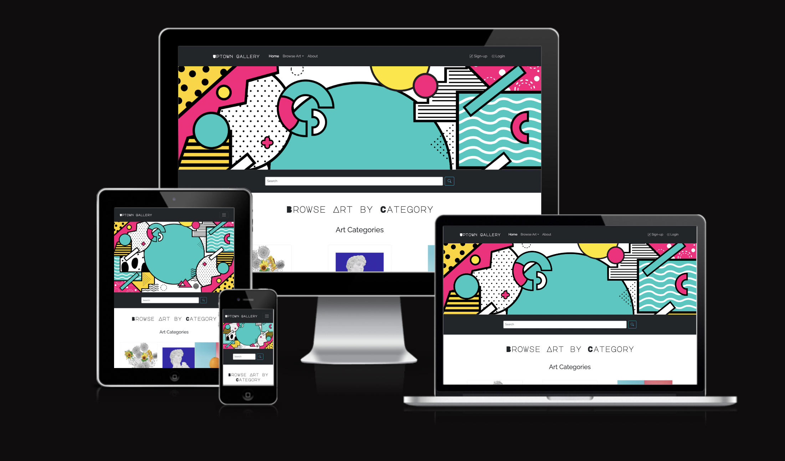
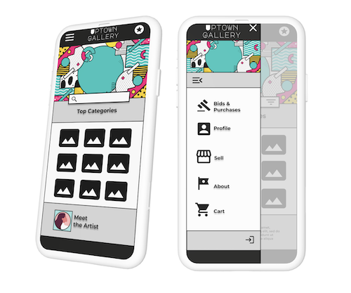
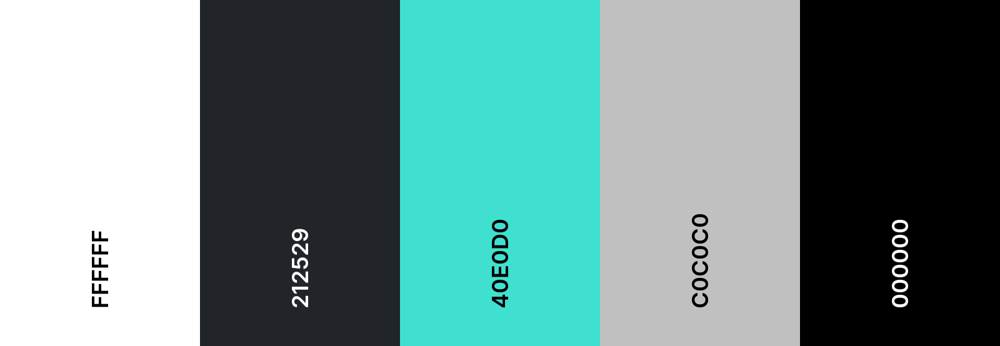
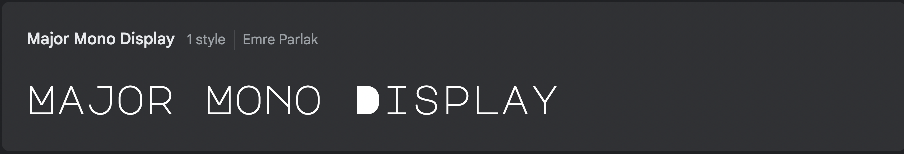
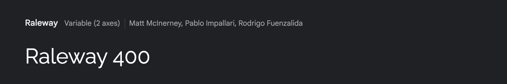

# Uptown Gallery Readme 📚

[Link to Live Site Here](https://uptowngallery-c4ad28352563.herokuapp.com/)

## 🤔 What is the Uptown Gallery Website?

Uptown Gallery is a vibrant and contemporary online platform dedicated to the world of urban modern art. This website serves as a dynamic space where art enthusiasts and collectors converge to discover, list, and bid on exquisite pieces of modern artwork.

## ⭐ Purpose and Goals of the Website

- Artwork Listing and Bidding: At the heart of Uptown Gallery is the ability for users to list and bid on artwork. This feature democratizes the art acquisition process, making it accessible and engaging for a broad audience of art lovers.

- Admin-Controlled Curation: Our platform ensures the quality and authenticity of art pieces through a robust backend approval process. Admins have the capability to control and curate the artwork listed on the website, maintaining high standards and a diverse collection.

## 🙋 Target Audience

- ### **🧙 Admins**
  Admins are the curators and gatekeepers of the Uptown Gallery platform. Their primary role is to oversee and manage the listing of artwork, ensuring that each piece aligns with the gallery's standards and aesthetic. They possess a keen eye for quality and authenticity, and are responsible for maintaining the integrity and diversity of the art collections on the site. Admins facilitate a smooth, secure, and engaging experience for all users, handling the backend processes and making executive decisions about the content and functionality of the website.

- ### **👨‍🎤 Bidders/Buyers**
  Bidders are art enthusiasts and collectors, ranging from seasoned connoisseurs to newcomers in the art world. They are attracted to the platform for its diverse collection of urban modern art and the exciting opportunity to acquire unique pieces through the bidding process. Bidders appreciate the accessibility and convenience of online bidding, and they contribute to the vibrant community of the gallery through their participation and engagement. They value transparency, authenticity, and the thrill of discovering new artists and artworks.

- ### **🧑‍🎨 Artists**
  Artists are the creative force behind Uptown Gallery, offering a window into the contemporary urban art scene. They are both creators and participants in the marketplace, listing their own artworks for sale and engaging with other artists and bidders. Artists on the platform are diverse in their styles and backgrounds, ranging from emerging talents to established names in the modern art scene. They seek a platform that not only showcases their work to a wider audience but also allows them to connect with fellow artists and art enthusiasts.

  **Note: The roles of Bidder and Artist are fluid on Uptown Gallery, with many users participating as both. This dual role fosters a rich, interactive community where users can experience the full spectrum of art appreciation, from creation to collection.The website is designed in such a way that Artists cannot Bid on their Artwork**

## 🧑 User stories

### 👨‍🎤 **Buyer Product Backlog Milestone**

#### **Buyer Browse Art**
| Issue ID                                                    | User Story                                                                                                      |
| ----------------------------------------------------------- | --------------------------------------------------------------------------------------------------------------- |
| [#10](https://github.com/emidombek/uptowngallery/issues/10) | As a As a buyer,I want to browse through available artworks.So that I can select one for purchase or to bid on. |

#### **Buyer Place Bid**
| Issue ID                                                    | User Story                                                                                 |
| ----------------------------------------------------------- | ------------------------------------------------------------------------------------------ |
| [#11](https://github.com/emidombek/uptowngallery/issues/11) | As a buyer,I want to place bids on artworks in the auction. So that I can win the auction. |

#### **Buyer Profile**
| Issue ID                                                    | User Story                                                                                                        |
| ----------------------------------------------------------- | ----------------------------------------------------------------------------------------------------------------- |
| [#13](https://github.com/emidombek/uptowngallery/issues/13) | As a buyer,I want to be able to view my buying/bidding history in my profile.So that I can keep track of my bids. |

### 🧑‍🎨 **Seller/Artist Product Backlog Milestone**

#### **Seller Create Art Listing**
| Issue ID                                                    | User Story                                                                                                              |
| ----------------------------------------------------------- | ----------------------------------------------------------------------------------------------------------------------- |
| [#15](https://github.com/emidombek/uptowngallery/issues/15) | As a seller, I want to create listings for artworks that I want to sell.So that I can sell my work through the website. |

#### **Seller Set Reserve/Starting Price**
| Issue ID                                                    | User Story                                                                                                                                    |
| ----------------------------------------------------------- | --------------------------------------------------------------------------------------------------------------------------------------------- |
| [#16](https://github.com/emidombek/uptowngallery/issues/16) | As a seller,I want to set starting bids and reserve prices for auction artworks.So that I can ensure my artwork sells for a reasonable price. |

#### **Seller Profile**
| Issue ID                                                    | User Story                                                                                                                                                          |
| ----------------------------------------------------------- | ------------------------------------------------------------------------------------------------------------------------------------------------------------------- |
| [#17](https://github.com/emidombek/uptowngallery/issues/17) | As a seller,I want to view the status of my listed artworks and their auction results in a 'Seller Profile' section.So that I can manage my sales more efficiently. |

### 🧙 **Admin Product Backlog Milestone**

#### **Admin Art Listing Approval**
| Issue ID                                                    | User Story                                                                                                                 |
| ----------------------------------------------------------- | -------------------------------------------------------------------------------------------------------------------------- |
| [#19](https://github.com/emidombek/uptowngallery/issues/19) | As an admin, I want to approve or reject artworks listed for auction/sale. So that I curate the art that my gallery sells. |

#### **Admin User Account Control**
| Issue ID                                                    | User Story                                                                                                                                       |
| ----------------------------------------------------------- | ------------------------------------------------------------------------------------------------------------------------------------------------ |
| [#20](https://github.com/emidombek/uptowngallery/issues/20) | As an admin, I want to manage user accounts and their roles (buyer/seller, admin).So that I am able to control my website and permissions on it. |

## 🖌 UX,Design and Layout

 ### 🖱 UX Concept

 

 ### 🌊 User Type Flowcharts

- [Buyer/Bidder](docs/images/buyer_flow.jpg)
- [Seller/Artist](docs/images/seller_flow.jpg)
- [Admin](docs/images/admin_flow.jpg)

 ### 🌈 Design System

   

   
Click here to view the Elements of the Design System

   
   *Color Palette*

   This color palette was selected to reflect the game theme, mood, contrast, and accessibility for an immersive and user-friendly experience.

   

   This font was chosen for its bold and easy-to-read structure while maintaining the theme of the game.

   *Font*

   

   Major Mono Display imported from [Google Fonts](https://fonts.google.com/specimen/Major+Mono+Display?query=Major+Mono+Display)

   

   Raleway 400 imported from [Google Fonts](https://fonts.google.com/specimen/Major+Mono+Display?query=Major+Mono+Display)

   *Iconography*

   Icons are taken from [Bootstrap Icons](https://icons.getbootstrap.com/)

   *Additional Fonts, Buttons, Navbar, Activity Dasboard, Hover Effects and Cards*

   These elements are styled using [Bootstrap 5.3](https://getbootstrap.com/docs/5.3/getting-started/introduction/)

   

 ### 🖼 Wireframes

 - [Link to Wireframes in Figma](https://www.figma.com/file/cf339FWQmbwsZm2SGmMJNE/Art-Gallery-Auction-App-High-Fi?type=design&node-id=0%3A1&mode=design&t=zQuFhoOFeGiG5taj-1)

## 🖥 Technology

- ### Languages:
    
    + [Python 3.11.5](https://www.python.org/downloads/release/python-385/): the primary language used to develop the server-side of the website.
    + [JS](https://www.javascript.com/): the primary language used to develop interactive components of the website.
    + [HTML](https://developer.mozilla.org/en-US/docs/Web/HTML): the markup language used to create the website.
    + [CSS](https://developer.mozilla.org/en-US/docs/Web/css): the styling language used to style the website.
    + [Bootstrap](https://icons.getbootstrap.com/): a CSS Framework used for developing responsive and mobile-first websites.

- ### Frameworks and libraries:

    + [Django](https://www.djangoproject.com/): python framework used to create all the logic.
    + [jQuery](https://jquery.com/): was used to control click events and sending AJAX requests.
    + [Bootstrap](https://jquery.com/): was used to control click events and sending AJAX requests.

- ### Databases:

    + [SQLite](https://www.sqlite.org/): was used as a development database.
    + [PostgreSQL](https://www.postgresql.org/): the database used to store all the data.

- ### Other tools:

    + [Git](https://git-scm.com/): the version control system used to manage the code.
    + [Pip3](https://pypi.org/project/pip/): the package manager used to install the dependencies.
    + [Gunicorn](https://gunicorn.org/): the webserver used to run the website.
    + [Spycopg2](https://www.python.org/dev/peps/pep-0249/): the database driver used to connect to the database.
    + [Django-allauth](https://django-allauth.readthedocs.io/en/latest/): the authentication library used to create the user accounts.
    + [Django-crispy-forms](https://django-cryptography.readthedocs.io/en/latest/): was used to control the rendering behavior of Django forms.
    + [Heroku](https://https://www.heroku.com/): the cloud platform used to host the website.
    + [ElephantSQL](https://www.elephantsql.com/): the cloud database used to store all the data.
    + [GitHub](https://github.com/): used to host the website's source code.
    + [VSCode](https://code.visualstudio.com/): the IDE used to develop the website.
    + [Chrome DevTools](https://developer.chrome.com/docs/devtools/open/): was used to debug the website.
    + [Bootstrap Icons](https://icons.getbootstrap.com/): was used to create the icons used on the website.
    + [Miro](https://miro.com/) was used to make a flowchart for the README file.
    + [Coolors](https://coolors.co/202a3c-1c2431-181f2a-0b1523-65e2d9-925cef-6b28e0-ffffff-eeeeee) was used to make a color palette for the website.
    + [W3C Validator](https://validator.w3.org/): was used to validate HTML5 code for the website.
    + [W3C CSS validator](https://jigsaw.w3.org/css-validator/): was used to validate CSS code for the website.
    + [JShint](https://jshint.com/): was used to validate JS code for the website.
    + [PEP8](https://pep8.org/): was used to validate Python code for the website.
    + [Django Q](https://django-q.readthedocs.io/en/latest/): Django Q is a native Django task queue, scheduler and worker application using Python multiprocessing. Used to update auction status after closure.
    + [Django Widget Tweaks](https://pypi.org/project/django-widget-tweaks/): Used to add extra classes to django html.
    + [Django Debug Toolbar](https://django-debug-toolbar.readthedocs.io/en/latest/): Used to debug various aspects during development.
    + [Cloudinary](https://cloudinary.com): Image/file cloud hosting service.
    + [Whitenoise](https://whitenoise.readthedocs.io/en/latest/): tool used in Django applications for serving static files.

  
## ✍ Agile Methodology

Github's issues, issue labels, milestones and project management board was used to help me track and organise the work in this project:

#### 💎 Milestones

The issues where orgnaised into Milestones and custom labels where create to add context and detail to each issue and it's status :

  - [#1 Infrastructure Setup](https://github.com/emidombek/uptowngallery/milestone/1?closed=1) 
  - [#2 Buyer Product Backlog](https://github.com/emidombek/uptowngallery/milestone/2?closed=1)
  - [#3 Seller Product Backlog](https://github.com/emidombek/uptowngallery/milestone/3?closed=1)
  - [#4 Admin Product Backlog](https://github.com/emidombek/uptowngallery/milestone/4?closed=1)

And then displayed on my Project Management Board:

Sorted by Issue Status and Milestone, clicking into the issue allowed for viewing labels and updating them:

  - [Project Board Screenshot](docs/images/projectdashboard.png)

  - [Added Labels Screenshot](docs/images/projectlabels.png)

  - [Project Board Link](https://github.com/users/emidombek/projects/3/views/1) 
  
## ✨ Features

Please refer to the [FEATURES.md](FEATURES.md) file for all features-related documentation.

## 🔢 Information Architecture

### 🗂 Database

* During develoopment the database was created using SQLite.
* The database was then migrated to PostgreSQL.

### [Database Schema ERD Diagram](docs/images/uptown_gallery_database_concept.jpg)

### 🪄 Data Modeling

 `UserProfile` 

| Field              | Type          | Description                                |
| ------------------ | ------------- | ------------------------------------------ |
| `user`             | OneToOneField | Linked to Django's User model              |
| `name`             | CharField     | The name of the user                       |
| `shipping_address` | CharField     | The shipping address of the user           |
| `create_date`      | DateTimeField | The date when the user profile was created |

 `Artwork` Model

| Field              | Type            | Description                                            |
| ------------------ | --------------- | ------------------------------------------------------ |
| `id`               | AutoField       | Primary key                                            |
| `artist`           | ForeignKey      | Linked to UserProfile                                  |
| `create_date`      | DateTimeField   | The date when the artwork was created                  |
| `title`            | CharField       | The title of the artwork                               |
| `description`      | TextField       | Description of the artwork                             |
| `image`            | CloudinaryField | Image of the artwork                                   |
| `category`         | CharField       | Category of the artwork                                |
| `approved`         | BooleanField    | Approval status of the artwork                         |
| `approval_status`  | CharField       | Detailed approval status (pending, approved, rejected) |
| `auction_start`    | DateTimeField   | Start date of the auction                              |
| `auction_duration` | CharField       | Duration of the auction                                |
| `reserve_price`    | DecimalField    | Minimum price for the artwork                          |

 `Auction` Model

| Field           | Type          | Description                           |
| --------------- | ------------- | ------------------------------------- |
| `id`            | AutoField     | Primary key                           |
| `artwork`       | ForeignKey    | Linked to Artwork model               |
| `create_date`   | DateTimeField | The date when the auction was created |
| `status`        | CharField     | Current status of the auction         |
| `is_active`     | BooleanField  | Active status of the auction          |
| `end_date`      | DateTimeField | End date of the auction               |
| `duration`      | CharField     | Duration of the auction               |
| `reserve_price` | IntegerField  | Minimum price for the artwork         |

 `Bids` Model

| Field      | Type          | Description                           |
| ---------- | ------------- | ------------------------------------- |
| `id`       | AutoField     | Primary key                           |
| `bidder`   | ForeignKey    | Linked to UserProfile model           |
| `auction`  | ForeignKey    | Linked to Auction model               |
| `amount`   | DecimalField  | Amount of the bid                     |
| `bid_time` | DateTimeField | Date and time when the bid was placed |

## 📝 Testing

Please refer to the [TESTING.md](TESTING.md) file for all test-related documentation.

## 🚀 Deployment

- The website was deployed to [Heroku](https://www.heroku.com).
- The database was deployed to [ElephantSQL](https://www.elephantsql.com/).

- This website can be found here [link](https://uptowngallery-c4ad28352563.herokuapp.com/).

Please refer to the [DEPLOYMENT.md](DEPLOYMENT.md) file for all deployment-related documentation.

## 🌟Credits

  - Custom 404/500 pages and views were taken from my mentor Juliia's ecommerce project and modified with her permission. 
  - All images used on the website are taken from [Vecteezy](https://www.vecteezy.com/) under free license.
  - Django Q information and setup was taken from [this youtube video](https://www.youtube.com/watch?v=w-5ukh_ef64) by 
  Valentino Gagliardi.
  - Lots of information taken from [this youtube video](https://www.youtube.com/watch?v=w-5ukh_ef64) on Django from FreeCodeCamp.
  - The entire series on advacned Python from [Patrick Loeber](https://www.youtube.com/@patloeber).
  - This video on [AJAX Requests](https://youtu.be/h0ZUpPiV1ac?si=QpPfUdfJt53dmHwn) from Net Ninja.

## 🏆 Acknowledgments

 - I would like to acknowledge my daughter and husband for their support and understanding during this time of intense learning.
 - My mentor Juliia for her guidance and suggestions, she has gone above and beyond and I am very grateful for her support and knowledge.

