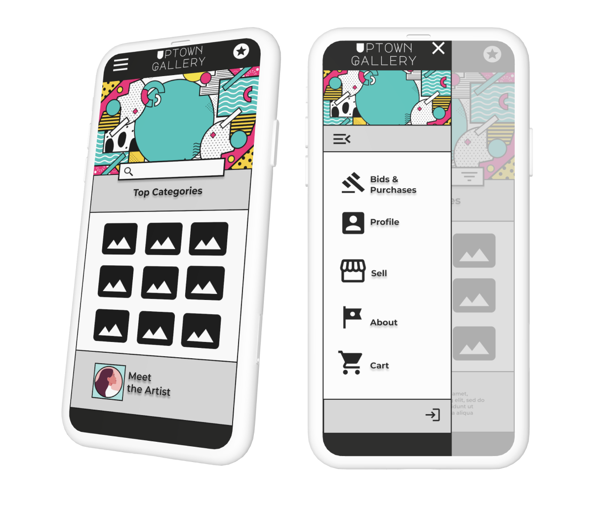

# Uptown Gallery Readme 📚

[Link to Live Site Here](https://uptowngallery-c4ad28352563.herokuapp.com/)

## 🤔 What is the Uptown Gallery Website?

Uptown Gallery is a vibrant and contemporary online platform dedicated to the world of urban modern art. This website serves as a dynamic space where art enthusiasts and collectors converge to discover, list, and bid on exquisite pieces of modern artwork.

## ⭐ Purpose and Goals of the Website

- Artwork Listing and Bidding: At the heart of Uptown Gallery is the ability for users to list and bid on artwork. This feature democratizes the art acquisition process, making it accessible and engaging for a broad audience of art lovers.

- Admin-Controlled Curation: Our platform ensures the quality and authenticity of art pieces through a robust backend approval process. Admins have the capability to control and curate the artwork listed on the website, maintaining high standards and a diverse collection.

## 🙋 Target Audience

- ### **🧙 Admins**
  Admins are the curators and gatekeepers of the Uptown Gallery platform. Their primary role is to oversee and manage the listing of artwork, ensuring that each piece aligns with the gallery's standards and aesthetic. They possess a keen eye for quality and authenticity, and are responsible for maintaining the integrity and diversity of the art collections on the site. Admins facilitate a smooth, secure, and engaging experience for all users, handling the backend processes and making executive decisions about the content and functionality of the website.

- ### **👨‍🎤 Bidders/Buyers**
  Bidders are art enthusiasts and collectors, ranging from seasoned connoisseurs to newcomers in the art world. They are attracted to the platform for its diverse collection of urban modern art and the exciting opportunity to acquire unique pieces through the bidding process. Bidders appreciate the accessibility and convenience of online bidding, and they contribute to the vibrant community of the gallery through their participation and engagement. They value transparency, authenticity, and the thrill of discovering new artists and artworks.

- ### **🧑‍🎨 Artists**
  Artists are the creative force behind Uptown Gallery, offering a window into the contemporary urban art scene. They are both creators and participants in the marketplace, listing their own artworks for sale and engaging with other artists and bidders. Artists on the platform are diverse in their styles and backgrounds, ranging from emerging talents to established names in the modern art scene. They seek a platform that not only showcases their work to a wider audience but also allows them to connect with fellow artists and art enthusiasts.

  **Note: The roles of Bidder and Artist are fluid on Uptown Gallery, with many users participating as both. This dual role fosters a rich, interactive community where users can experience the full spectrum of art appreciation, from creation to collection.**

## 🧑 User stories

### **Buyer Product Backlog Milestone**

#### **Buyer Browse Art**
| Issue ID                                                    | User Story                                                                                                      |
| ----------------------------------------------------------- | --------------------------------------------------------------------------------------------------------------- |
| [#10](https://github.com/emidombek/uptowngallery/issues/10) | As a As a buyer,I want to browse through available artworks.So that I can select one for purchase or to bid on. |

#### **Buyer Place Bid**
| Issue ID                                                    | User Story                                                                                 |
| ----------------------------------------------------------- | ------------------------------------------------------------------------------------------ |
| [#11](https://github.com/emidombek/uptowngallery/issues/11) | As a buyer,I want to place bids on artworks in the auction. So that I can win the auction. |

#### **Buyer Profile**
| Issue ID                                                    | User Story                                                                                                        |
| ----------------------------------------------------------- | ----------------------------------------------------------------------------------------------------------------- |
| [#13](https://github.com/emidombek/uptowngallery/issues/13) | As a buyer,I want to be able to view my buying/bidding history in my profile.So that I can keep track of my bids. |

### **Seller/Artist Product Backlog Milestone**

#### **Seller Create Art Listing**
| Issue ID                                                    | User Story                                                                                                              |
| ----------------------------------------------------------- | ----------------------------------------------------------------------------------------------------------------------- |
| [#15](https://github.com/emidombek/uptowngallery/issues/15) | As a seller, I want to create listings for artworks that I want to sell.So that I can sell my work through the website. |

#### **Seller Set Reserve/Starting Price**
| Issue ID                                                    | User Story                                                                                                                                    |
| ----------------------------------------------------------- | --------------------------------------------------------------------------------------------------------------------------------------------- |
| [#16](https://github.com/emidombek/uptowngallery/issues/16) | As a seller,I want to set starting bids and reserve prices for auction artworks.So that I can ensure my artwork sells for a reasonable price. |

#### **Seller Profile**
| Issue ID                                                    | User Story                                                                                                                                                          |
| ----------------------------------------------------------- | ------------------------------------------------------------------------------------------------------------------------------------------------------------------- |
| [#17](https://github.com/emidombek/uptowngallery/issues/17) | As a seller,I want to view the status of my listed artworks and their auction results in a 'Seller Profile' section.So that I can manage my sales more efficiently. |

### **Admin Product Backlog Milestone**

#### **Admin Art Listing Approval**
| Issue ID                                                    | User Story                                                                                                                 |
| ----------------------------------------------------------- | -------------------------------------------------------------------------------------------------------------------------- |
| [#19](https://github.com/emidombek/uptowngallery/issues/19) | As an admin, I want to approve or reject artworks listed for auction/sale. So that I curate the art that my gallery sells. |

#### **Admin User Account Control**
| Issue ID                                                    | User Story                                                                                                                                       |
| ----------------------------------------------------------- | ------------------------------------------------------------------------------------------------------------------------------------------------ |
| [#20](https://github.com/emidombek/uptowngallery/issues/20) | As an admin, I want to manage user accounts and their roles (buyer/seller, admin).So that I am able to control my website and permissions on it. |

## 🖌 UX,Design and Layout

 ### 🖱 UX Concept 

 

 ### 🌊 User Type Flowcharts

- [Buyer/Bidder](static/docs/images/buyer_flow.jpg)
- [Seller/Artist](static/docs/images/seller_flow.jpg)
- [Admin](static/docs/images/admin_flow.jpg)

 ### 🌈 Design System

 ### 🖼 Wireframes

 - [Link to Wireframes in Figma](https://www.figma.com/file/cf339FWQmbwsZm2SGmMJNE/Art-Gallery-Auction-App-High-Fi?type=design&node-id=0%3A1&mode=design&t=zQuFhoOFeGiG5taj-1)

## 🖥 Technology

## ✍ Agile Methodology

## ✨ Features

Please refer to the [FEATURES.md](FEATURES.md) file for all features-related documentation.

## 🔢 Information Architecture

## 📝 Testing

Please refer to the [TESTING.md](TESTING.md) file for all test-related documentation.

## 🚀 Deployment

- The website was deployed to [Heroku](https://uptowngallery-c4ad28352563.herokuapp.com/).
- The database was deployed to [ElephantSQL](https://www.elephantsql.com/).

- This website can be found here [link](https://cool-school.onrender.com).

Please refer to the [DEPLOYMENT.md](DEPLOYMENT.md) file for all deployment-related documentation.

## 🌟Credits

## 👩‍💻 Resources

## 🏆 Acknowledgments

